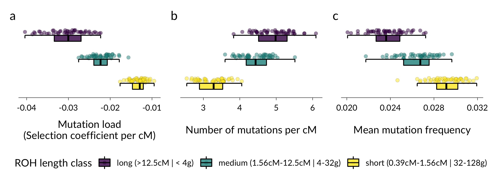

# Code for:

Stoffel, MA, Johnston, SE, Pilkington, JG, Pemberton, JM (2021): **Mutation load decreases with haplotype age in wild Soay sheep.**  *Evolution Letters.* https://doi.org/10.1002/evl3.229.  

 

 

### Project
Runs of homozygosity (ROH) are regions in the genome where individuals inherited two copies of the same ancestral haplotype, and cause an increase in expressed deleterious recessive alleles. It has been suggested that longer ROH have a higher density of damaging mutations, as they are made up of younger haplotypes relatively untouched by selection. We used both empirical analyses in a large sample of wild Soay sheep and detailed forward genetic simulations showing that long ROH are more likely to harbour more and stronger deleterious mutations.

 

  

 <i> Long runs of homozygosity (ROH) are enriched for deleterious mutations in genetic simulations.</i>

 

### Code structure
This repository contains the analysis code for our paper under scripts/. For a smooth process, create a directory with sub-directories scripts/ data/ output/ figs/ tables/ . Put all the data associated with the paper (will be uploaded to Zenodo once accepted) in the data folder, so that the relative filepaths work correctly. These are the main scripts:

**1_make_cM_map_files:** Converts physical position PLINK .map file to cM positions, and uses interpolation to infer cM position for SNPs which are not part of the linkage map.

**2_call_roh:** ROH calling and quality control.

**3_roh_length_classes:** Divides ROH into length classes, calculates different Froh based on these classes and combines ROH and fitness data.

**4_modeling:** Mixed models to estimate inbreeding depression per ROH length class.

**5_plot_model:** Formatting and plotting of the modeling results and Figure 1.

**6_plot_simulations:** Plotting SLiM simulations (requires to run SLiM simulations first, see below)

### SLiM simulations
 
 The SLiM simulations should be run on a cluster and require SLiM, python3 and the python packages PySlim, msprime and numpy to be installed. Also, users might have to adjust the python3 / slim paths in the scripts.
 
 **slim_sims_pipeline.R:** This is the main script which runs the complete pipeline on a cluster and is used like this: `Rscript slim_sims_pipeline.R out_path anc_Ne cur_Ne`, where out_path is the path to a folder for the results, anc_Ne is the ancestral Ne of the simulated population and cur_Ne is the current Ne of the simulated population.
 
The script sources three other scripts at the beginning (make sure the paths are correct here):

**make_slim.R:**: Makes a slim simulation file from parameters.

**combine_mut_roh.R:** Combines mutation and ROH data.

**correct_vcf.R:** Modifies vcf's outputted by SLiM to always work with PLINK. 

**slim2_overlay_mut.py:** Python script for recapitation and to overlay neutral mutations.

The other scripts are either producing analyses/plots for the supplementary material (**sup_** scripts) or doing things which weren't presented in the manuscript.

Please feel free to write me an email if you've got any questions about the code.
